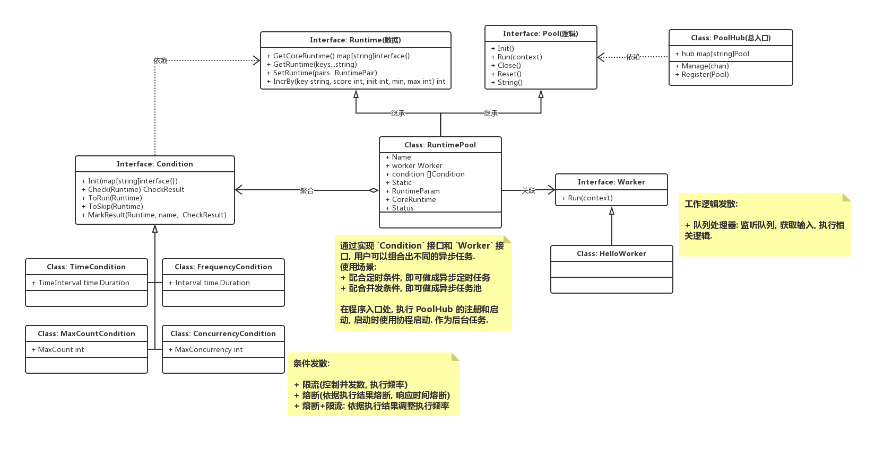

基于 golang 协程来执行定时任务

功能:

1. 指定时间点执行 !
2. 指定时间频率执行 !
3. 指定执行总次数 !
4. 指定同时执行的并发数 !
5. 指定每次执行的并发数 todo

控制:

1. 有限时间内正常启动 !
2. 有限时间内正常退出 !
3. 对错误做出相应的应对 !
4. 定义和控制任务运行的状态 !

定制:

1. 允许用户自定义需要执行的任务(符合规范).

接口设计如图 `异步任务处理模型.png`

